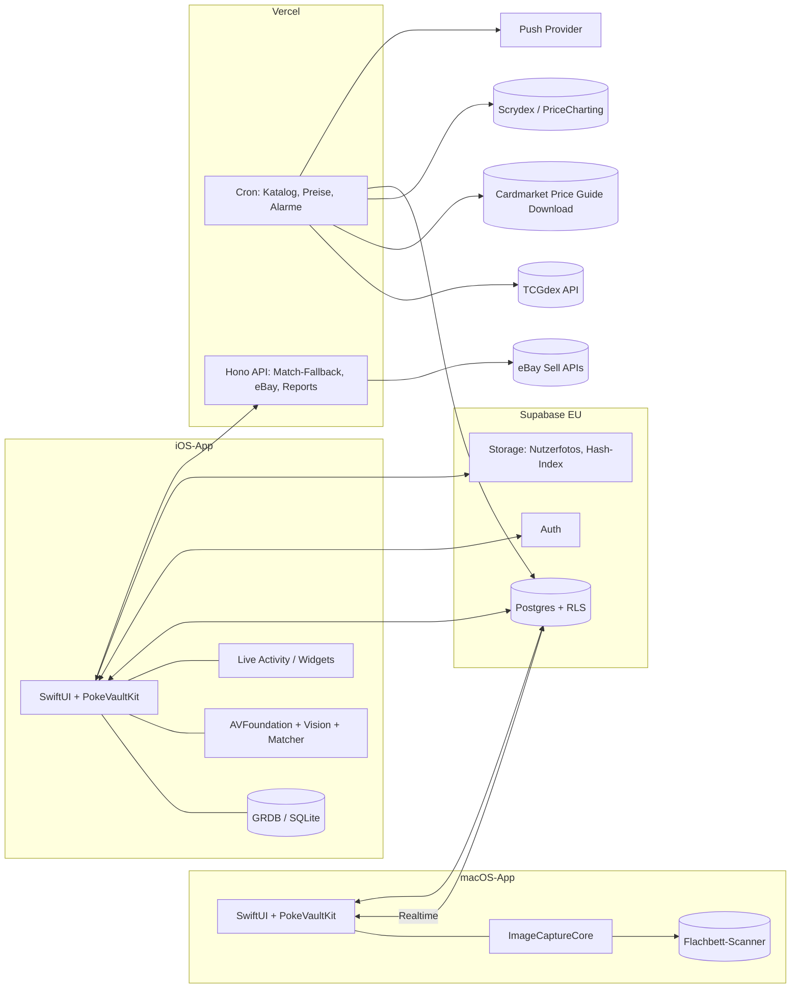

# 03 – Architektur

## Tech-Stack (ADR-001 bis 004, angenommen)

| Schicht | Wahl | Begründung |
|---|---|---|
| iOS-App + macOS-App | **Ein Xcode-Projekt, SwiftUI**, Targets iOS 17+ und macOS 14+; Domänenlogik im Swift-Package `PokeVaultKit` | Beste Integration für Kamera, Scanner, Live Activity; ein UI-Code für beide Plattformen. |
| Kamera (iPhone) | AVFoundation + Vision (`VNDetectRectanglesRequest`, `VNRecognizeTextRequest`) | Eingebaut, schnell, kein Drittanbieter. |
| Scanner (Mac) | ImageCaptureCore | Treiberlos, jeder am Mac funktionierende Scanner (ADR-003). |
| Dynamic Island / Widgets | ActivityKit, WidgetKit, alternative Icons | Nativ, kein Brückenmodul. |
| Lokaler Cache | GRDB (SQLite) in `PokeVaultKit` | Offline-Anzeige, Outbox für Sync (ADR-004). |
| Backend | **Supabase** (Postgres, Auth mit Sign in with Apple, Storage, Realtime, RLS), neues Projekt in bestehender Org, EU Frankfurt | ADR-002. |
| Client-SDK | supabase-swift | Offizielles SDK für Auth, PostgREST, Realtime, Storage. |
| Worker / Jobs | **TypeScript auf Vercel Cron** (Hono): Katalog-Sync, Cardmarket-Snapshots in Chunks, Alarm-Auswertung, Hash-Index-Build | ADR-002; Pro-Plan vorhanden. |
| Statische Seiten | Vercel (Datenschutz, Impressum, Landingpage) | |
| Geteilte Verträge | `packages/shared` (Zod + JSON-Schema) → **generierte Swift-Typen** (z. B. quicktype) im CI | Eine Quelle für Typen in TS und Swift. |
| Berechnete Werte | Postgres-Views/RPCs (Preis-Δ, Portfolio-Historie, Winner/Loser, Grading-ROI) | Logik nur einmal, Client zeigt an. |
| Matcher | dHash/pHash in Swift (Client) **und** TypeScript (Worker, Index-Bau); gemeinsame Testvektoren `fixtures/hash-vectors.json` | Beide Implementierungen müssen identische Hashes liefern. |
| Charts | Swift Charts | Eingebaut. |
| Monorepo | pnpm workspaces + Turborepo für TS-Teile; `apps/apple` daneben mit Xcode-Projekt | |
| CI | GitHub Actions (Linux) für TS; **Xcode Cloud** (25 h/Monat im Developer Program) für Swift-Build/Tests/TestFlight | macOS-Runner bei GitHub sind teuer. |
| Distribution | iOS: TestFlight → App Store. macOS: notarisierter Download (Sparkle-Updates) oder Mac App Store | |

## Repo-Struktur

```
.
├── apps/
│   ├── apple/             # Xcode-Projekt: Targets iOS + macOS + Widget-Extension
│   │   ├── PokeVault/     # App (SwiftUI, plattformspezifische Views in iOS/ und macOS/)
│   │   └── PokeVaultKit/  # Swift-Package: Modelle, Sync, Matcher, Segmentierung, Tests
│   └── worker/            # Vercel: Cron-Jobs + HTTP-Endpoints (Hono, TypeScript)
├── packages/
│   ├── shared/            # Zod-Schemas, Konstanten (Zustände, Sprachen, Varianten) → Swift-Codegen
│   ├── db/                # Drizzle-Schema, generierte Typen
│   ├── pricing/           # Preis-Provider-Interface + Implementierungen (cardmarket, tcgplayer, …)
│   └── card-matcher/      # Hashing + Index-Bau in TS (Worker); Testvektoren für Swift
├── fixtures/              # Hash-Testvektoren, Beispielscans, Beispielfotos
├── supabase/              # config, migrations (SQL), seed
├── docs/
├── .claude/               # geteilte Claude-Code-Settings, Commands, Skills
└── CLAUDE.md
```

## Systemübersicht



## Datenmodell (Kern)

```
cards                (id [tcgdex], game, set_id, number, name_by_lang jsonb, rarity, supertype, image_urls_by_lang jsonb, variants text[], released_on)
sets                 (id, series, name_by_lang, total, printed_total, released_on, symbol_url)
price_snapshots      (card_id, variant, source, currency, captured_on, avg, low, trend, avg1, avg7, avg30)  -- partitioniert nach Monat
graded_price_snapshots (card_id, grader, grade, source, currency, captured_on, price)
fx_rates             (date, base, quote, rate)
card_external_ids    (card_id, source, external_id, confidence, verified_by)  -- z. B. Cardmarket idProduct
cardmarket_products  (id_product, name, id_expansion, id_metacard, is_single, date_added)  -- Rohkatalog

users                (Supabase auth)
collection_items     (id, user_id, card_id, variant, language, condition, quantity, is_graded, grader, grade, cert_no,
                      purchase_price, purchase_currency, purchased_on, tags text[], notes, binder_id, binder_slot, photo_urls, created_at)
sealed_products      (id, name, set_id, type, ean, image_url)
sealed_items         (id, user_id, product_id, quantity, purchase_price, purchased_on, tags)
sales                (id, user_id, item_id, platform, sold_price, fees, shipping, sold_on, buyer_country)
wishlist_items       (id, user_id, card_id, variant, language, target_price, alert_rule jsonb)
alerts               (id, user_id, rule jsonb, last_fired_at)
binders              (id, user_id, name, layout, sort)
master_set_goals     (id, user_id, set_id, include_reverse, include_secret, …)
portfolio_snapshots  (user_id, date, total_value_eur, cost_basis_eur, item_count)
graders / grader_service_tiers (redaktionell)
ebay_connections     (user_id, refresh_token enc, policies, location_key)
```

Regeln:
- **Alle Geldbeträge als `numeric(12,2)` + Währungsspalte**, nie float.
- `collection_items` ist die einzige Wahrheit für "was besitze ich". Alles andere (Portfolio, Master-Set-Fortschritt, Winner/Loser) wird abgeleitet.
- Lokale SQLite (GRDB) spiegelt `collection_items`, `sealed_items`, `wishlist_items`, `binders`, `sales`. Sync nach ADR-004: Outbox + Delta-Pull über `updated_at` + Soft-Delete, Realtime für Sofort-Updates, Last-Write-Wins pro Zeile.

## Scanner-Pipeline

```
Frame → Karten-Detektion (Rechteck, 63×88 mm Ratio) → Perspektiv-Korrektur → Normalisieren (z. B. 256×358)
     → Hash (dHash 64-bit + pHash 64-bit über Artwork-Region und Gesamtkarte)
     → Hamming-Suche im lokalen Index (BK-Tree / lineare Suche über ~30k Einträge ist auf Mobile in <20 ms machbar)
     → Top-k Kandidaten
     → Tiebreaker: OCR der Kartennummer ("136/189") + Set-Symbol-Region-Hash
     → Konfidenz ≥ Schwelle: Auto-Add (Bulk) bzw. Vorschlag (Einzel); sonst Review-Queue mit Top-3
```

- **Hash-Index** wird im Worker (TS) aus den TCGdex-Bildern gebaut (pro Sprache!) und als komprimierte Datei über Storage ausgeliefert; die App lädt die Sprachen, die der Nutzer aktiviert hat. Der Client hasht in Swift; beide Implementierungen werden gegen `fixtures/hash-vectors.json` getestet. ~30k Karten × 2 Hashes × 8 Byte ≈ 0,5 MB pro Sprache.
- **Bulk/Video-Modus:** AVCaptureVideoDataOutput mit ~10 fps; ein Match gilt erst als stabil, wenn er in 3 aufeinanderfolgenden Frames identisch ist; danach Cooldown, bis ein anderer Hash erscheint. Haptisches Feedback + Chip-Liste oben, Undo per Swipe.
- **Reverse Holo vs. Normal** ist per Hash schwer zu unterscheiden → Nutzer wählt Variante per Toggle (Default merkbar), später Glanz-Heuristik.
- **Fallback:** Bei Konfidenz unter Schwelle kann das Bild (opt-in) an den Worker geschickt werden, der mit einem Embedding-Modell sucht; alternativ ein kleines CoreML-Embedding-Modell on-device. Erst ab Phase 3.
- **Flachbett-Pfad (Desktop):** Scan → Segmentierung in Einzelkarten (Rechtecke mit 63:88) → Rotation → derselbe Hash/OCR-Match wie oben, nur ohne Perspektiv-Korrektur und mit höherer Trefferquote. Details ADR-003.
- **Vorbild-Projekte:** Open-Source-Scanner mit pHash + Hamming-Distanz (jslok/card-scanner, 1vcian/Pokemon-TCGP-Card-Scanner, em4go/PokeCard-TCG-detector) zeigen, dass der Ansatz funktioniert.

## Live Activity / Dynamic Island

- Widget-Extension-Target im Xcode-Projekt (ActivityKit + WidgetKit), Daten über App Group.
- Inhalte: Portfolio-Wert + 24h-Δ, laufende Scan-Session (Anzahl erkannt), aktiver Preisalarm.
- Wählbares Pokémon-Icon: kuratiertes Icon-Set (eigene Illustrationen/Pixel-Art, **nicht** offizielle Artworks) im Extension-Bundle, per App Group als Auswahl gespeichert.
- Grenzen: max. 8 h aktiv, Nutzer kann Live Activities deaktivieren, 30 MB Speicher-Limit in der Extension, nur ein Live Activity gleichzeitig sichtbar in der Island.

## Preis-Engine

`packages/pricing` definiert:

```ts
interface PriceProvider {
  id: 'cardmarket' | 'tcgplayer' | 'pricecharting' | 'scrydex' | 'manual';
  fetchBatch(cardIds: string[]): Promise<PricePoint[]>;
}
```

Der `cardmarket`-Provider lädt die öffentliche Price-Guide-Datei (kein API-Key) und löst `idProduct` über `card_external_ids` auf; `tcgplayer` (USD) kommt über TCGdex. TCGdex' eigene Cardmarket-Preise sind dieselbe Datei und werden nicht genutzt (`10-vergleich-cardmarket-tcgdex.md`). Worker orchestriert Provider, schreibt Snapshots, berechnet daraus:
- `card_price_current` (Materialized View: letzter Snapshot pro Karte/Variante/Quelle),
- `card_price_change` (Δ 24h/7d/30d/90d),
- Portfolio-Snapshots pro Nutzer,
- Alarm-Auswertung (Wishlist/Verkaufs-Alarme) → Push.

## Sicherheit

- RLS auf allen Nutzertabellen (`user_id = auth.uid()`).
- eBay-Refresh-Tokens verschlüsselt (pgsodium / Vault), nie an den Client.
- Nutzerfotos in privaten Buckets, signierte URLs.
- Secrets nur in EAS/Fly-Secrets, `.env.example` im Repo.
