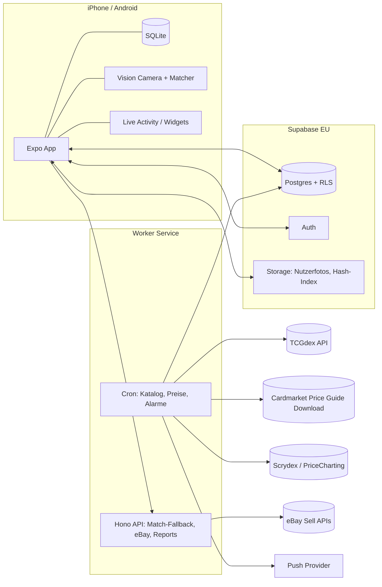

# 03 – Architektur

## Tech-Stack (Empfehlung, als ADR-001 zu bestätigen)

| Schicht | Wahl | Begründung |
|---|---|---|
| Mobile App | **Expo (React Native) + TypeScript**, Expo Router, `react-native-vision-camera` (Frame-Prozessoren), `expo-sqlite` + Drizzle für lokale DB | iOS + Android aus einer Codebase; TS über den ganzen Stack → Claude Code und beide Devs arbeiten in einer Sprache; Vision Camera erlaubt Echtzeit-Frame-Verarbeitung für den Scanner. |
| iOS-native Teile | **Expo Modules (Swift)**: Live Activity / Dynamic Island, WidgetKit, alternative App-Icons | Nur hier braucht es Swift. Als eigenes Paket kapseln, damit es den Rest nicht blockiert. |
| Backend | **Supabase** (Postgres, Auth, Storage, Row Level Security, Realtime) in EU-Region | Auth/Storage/RLS fertig, wir konzentrieren uns auf Domäne. |
| Worker / Jobs | **Node/TS-Service** (Fly.io oder Railway, EU) mit Cron: Katalog-Sync, Preis-Snapshots, Alarm-Auswertung, Hash-Index-Build | Supabase Edge Functions sind für 20k-Karten-Batches zu limitiert (Timeouts). |
| API-Layer | Supabase direkt (PostgREST + RLS) für CRUD; eigene HTTP-Endpoints (Hono auf dem Worker) für Scanner-Matching-Fallback, eBay-Proxy, Reports | Vermeidet eine zweite Backend-Codebasis für Standard-CRUD. |
| Charts | `victory-native` (Skia) | Performant auf Mobile. |
| Monorepo | **pnpm workspaces + Turborepo** | Ein Repo, geteilte Typen, klare Paketgrenzen für Zwei-Personen-Arbeit. |
| CI | GitHub Actions: Lint, Typecheck, Tests, EAS Build (Preview) auf PR | |
| Distribution | EAS Build + TestFlight / Play Internal Testing | |

**Alternative, die wir bewusst verworfen haben:** Native SwiftUI-App. Beste Kamera-/ML-Integration und Dynamic Island "for free", aber iOS-only und zwei Sprachen im Stack (Swift + Backend-TS). Falls beide Devs stark Apple-fokussiert sind und Android egal ist, ist das die bessere Wahl. Entscheidung in ADR-001.

## Repo-Struktur

```
.
├── apps/
│   ├── mobile/            # Expo-App
│   └── worker/            # Cron-Jobs + HTTP-Endpoints (Hono)
├── packages/
│   ├── shared/            # Zod-Schemas, Domain-Typen, Konstanten (Zustände, Sprachen, Varianten)
│   ├── db/                # Drizzle-Schema, Migrationen (Supabase), generierte Typen
│   ├── pricing/           # Preis-Provider-Interface + Implementierungen (tcgdex, pricecharting, …)
│   ├── card-matcher/      # Hashing, Matching-Logik (reines TS, plattformneutral, testbar)
│   └── ui/                # Design-System (Tokens, Komponenten)
├── supabase/              # config, migrations (SQL), seed
├── docs/
├── .claude/               # geteilte Claude-Code-Settings, Commands, Skills
└── CLAUDE.md
```

## Systemübersicht



## Datenmodell (Kern)

```
cards                (id [tcgdex], game, set_id, number, name_by_lang jsonb, rarity, supertype, image_urls_by_lang jsonb, variants text[], released_on)
sets                 (id, series, name_by_lang, total, printed_total, released_on, symbol_url)
price_snapshots      (card_id, variant, source, currency, captured_on, avg, low, trend, avg1, avg7, avg30)  -- partitioniert nach Monat
graded_price_snapshots (card_id, grader, grade, source, currency, captured_on, price)
fx_rates             (date, base, quote, rate)
card_external_ids    (card_id, source, external_id, confidence, verified_by)  -- z. B. Cardmarket idProduct
cardmarket_products  (id_product, name, id_expansion, id_metacard, is_single, date_added)  -- Rohkatalog

users                (Supabase auth)
collection_items     (id, user_id, card_id, variant, language, condition, quantity, is_graded, grader, grade, cert_no,
                      purchase_price, purchase_currency, purchased_on, tags text[], notes, binder_id, binder_slot, photo_urls, created_at)
sealed_products      (id, name, set_id, type, ean, image_url)
sealed_items         (id, user_id, product_id, quantity, purchase_price, purchased_on, tags)
sales                (id, user_id, item_id, platform, sold_price, fees, shipping, sold_on, buyer_country)
wishlist_items       (id, user_id, card_id, variant, language, target_price, alert_rule jsonb)
alerts               (id, user_id, rule jsonb, last_fired_at)
binders              (id, user_id, name, layout, sort)
master_set_goals     (id, user_id, set_id, include_reverse, include_secret, …)
portfolio_snapshots  (user_id, date, total_value_eur, cost_basis_eur, item_count)
graders / grader_service_tiers (redaktionell)
ebay_connections     (user_id, refresh_token enc, policies, location_key)
```

Regeln:
- **Alle Geldbeträge als `numeric(12,2)` + Währungsspalte**, nie float.
- `collection_items` ist die einzige Wahrheit für "was besitze ich". Alles andere (Portfolio, Master-Set-Fortschritt, Winner/Loser) wird abgeleitet.
- Lokale SQLite spiegelt `collection_items`, `wishlist_items`, `binders` (Offline). Sync über `updated_at` + Soft-Delete (`deleted_at`), Konfliktlösung "last write wins" pro Zeile.

## Scanner-Pipeline

```
Frame → Karten-Detektion (Rechteck, 63×88 mm Ratio) → Perspektiv-Korrektur → Normalisieren (z. B. 256×358)
     → Hash (dHash 64-bit + pHash 64-bit über Artwork-Region und Gesamtkarte)
     → Hamming-Suche im lokalen Index (BK-Tree / lineare Suche über ~30k Einträge ist auf Mobile in <20 ms machbar)
     → Top-k Kandidaten
     → Tiebreaker: OCR der Kartennummer ("136/189") + Set-Symbol-Region-Hash
     → Konfidenz ≥ Schwelle: Auto-Add (Bulk) bzw. Vorschlag (Einzel); sonst Review-Queue mit Top-3
```

- **Hash-Index** wird im Worker aus den TCGdex-Bildern gebaut (pro Sprache!) und als komprimierte Datei über Storage ausgeliefert; die App lädt die Sprachen, die der Nutzer aktiviert hat. ~30k Karten × 2 Hashes × 8 Byte ≈ 0,5 MB pro Sprache.
- **Bulk/Video-Modus:** Frame-Prozessor läuft mit ~10 fps; ein Match gilt erst als stabil, wenn er in 3 aufeinanderfolgenden Frames identisch ist; danach Cooldown, bis ein anderer Hash erscheint. Haptisches Feedback + Chip-Liste oben, Undo per Swipe.
- **Reverse Holo vs. Normal** ist per Hash schwer zu unterscheiden → Nutzer wählt Variante per Toggle (Default merkbar), später Glanz-Heuristik.
- **Fallback:** Bei Konfidenz unter Schwelle kann das Bild (opt-in) an den Worker geschickt werden, der mit einem Embedding-Modell (z. B. CLIP/DINOv2-Small) sucht. Erst ab Phase 3.
- **Vorbild-Projekte:** Open-Source-Scanner mit pHash + Hamming-Distanz (jslok/card-scanner, 1vcian/Pokemon-TCGP-Card-Scanner, em4go/PokeCard-TCG-detector) zeigen, dass der Ansatz funktioniert.

## Live Activity / Dynamic Island

- Swift-Widget-Extension über Expo Config Plugin (`expo-live-activity` oder eigenes Modul).
- Inhalte: Portfolio-Wert + 24h-Δ, laufende Scan-Session (Anzahl erkannt), aktiver Preisalarm.
- Wählbares Pokémon-Icon: kuratiertes Icon-Set (eigene Illustrationen/Pixel-Art, **nicht** offizielle Artworks) im Extension-Bundle, per App Group als Auswahl gespeichert.
- Grenzen: max. 8 h aktiv, Nutzer kann Live Activities deaktivieren, 30 MB Speicher-Limit in der Extension, nur ein Live Activity gleichzeitig sichtbar in der Island.

## Preis-Engine

`packages/pricing` definiert:

```ts
interface PriceProvider {
  id: 'cardmarket' | 'tcgdex' | 'pricecharting' | 'scrydex' | 'manual';
  fetchBatch(cardIds: string[]): Promise<PricePoint[]>;
}
```

Der `cardmarket`-Provider lädt die öffentliche Price-Guide-Datei (kein API-Key) und löst `idProduct` über `card_external_ids` auf. Worker orchestriert Provider, schreibt Snapshots, berechnet daraus:
- `card_price_current` (Materialized View: letzter Snapshot pro Karte/Variante/Quelle),
- `card_price_change` (Δ 24h/7d/30d/90d),
- Portfolio-Snapshots pro Nutzer,
- Alarm-Auswertung (Wishlist/Verkaufs-Alarme) → Push.

## Sicherheit

- RLS auf allen Nutzertabellen (`user_id = auth.uid()`).
- eBay-Refresh-Tokens verschlüsselt (pgsodium / Vault), nie an den Client.
- Nutzerfotos in privaten Buckets, signierte URLs.
- Secrets nur in EAS/Fly-Secrets, `.env.example` im Repo.
