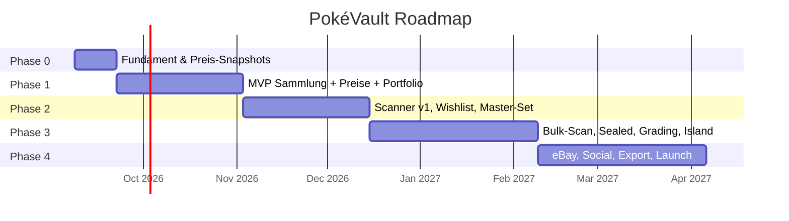

# 04 – Roadmap

Annahme: zwei Entwickler, Teilzeit (~10–15 h/Woche pro Person), jeweils mit Claude Code. Wochenangaben sind Richtwerte, keine Deadlines. Jede Phase endet mit einem **Milestone**, der auf echten Geräten getestet ist.

---

## Phase 0 – Fundament (Woche 1–2) → Milestone **M0 "Snapshots laufen"**

Ziel: Repo, Infrastruktur und der tägliche Preis-Snapshot laufen. **Ab M0 sammeln wir Preis-Historie**, das ist der Grund, warum diese Phase so früh und so klein ist.

| Task | Owner-Vorschlag | Ergebnis |
|---|---|---|
| ADR-001 Tech-Stack bestätigen (Expo vs. Native) | beide | ADR gemerged |
| Monorepo aufsetzen (pnpm, Turborepo, ESLint, Prettier, TS strict, Vitest) | Dev A | `pnpm lint/test/typecheck` grün |
| Supabase-Projekt (EU) + lokales Setup (`supabase start`) + Migrations-Workflow | Dev B | erste Migration gemerged |
| `packages/db`: Schema `cards`, `sets`, `price_snapshots`, `fx_rates` | Dev B | Migration + Drizzle-Typen |
| Cardmarket-Quellenangabe und Link-Konvention festlegen (Attribution in Kartendetail, Portfolio, Store-Text) | Dev A | Konvention in `packages/ui` dokumentiert |
| `apps/worker`: Katalog-Import aus dem TCGdex-Datenbank-Clone (alle Sprachen, `thirdParty`-IDs, Attacken) + Cardmarket-Produktkatalog-Import | Dev B | ~42k Karten + 78k Cardmarket-Produkte in DB |
| `apps/worker`: ID-Mapping Cardmarket ↔ TCGdex nach Pipeline in `08-id-mapping.md` (TCGdex-Seed, Expansion-Tabelle, Name+Attacken, Reihenfolge), Abdeckung messen | Dev B | ≥ 90 % der Karten mit Trend ≥ 5 € gemappt, Rest in Review-Tabelle |
| Manuelle Kuratierung `cardmarket_expansions` (774 Zeilen, Sprache + TCGdex-Set) | Dev A | Tabelle vollständig |
| `apps/worker`: täglicher Preis-Snapshot-Job (Cardmarket-Download + TCGdex) + Rohdatei-Archiv + FX-Job, Deploy auf Fly.io, Alerting bei Fehlschlag | Dev B | Cron läuft in Prod |
| Expo-App-Skeleton: Router, Auth-Screens (Supabase), Design-Tokens, Navigation-Grundgerüst | Dev A | App startet, Login funktioniert |
| CI: Lint/Typecheck/Test auf PR, EAS Preview Build | Dev A | PR-Checks grün |
| `CLAUDE.md`, `.claude/`-Commands, PR-Template, Issue-Labels | beide | Team-Konventionen live |

## Phase 1 – MVP Sammlung (Woche 3–8) → Milestone **M1 "Ich sehe, was meine Sammlung wert ist"**

Features: A1, A2, B1, B2, B3, B4, B11, C1, F3, F4, F7, G4 (Basis).

| Task | Owner | Notizen |
|---|---|---|
| Katalog-Browsing: Sets → Karten, Suche, Filter (Sprache, Rarity), Kartendetail mit Bild in gewählter Sprache | Dev A | Bilder via TCGdex-CDN, Cache |
| Kartendetail: aktueller Preis (EUR/USD), Δ 24h/7d/30d, Chart mit Zeitraum-Umschalter | Dev A | Chart-Daten aus `price_snapshots` |
| Sammlung: Item hinzufügen/bearbeiten/löschen (Menge, Zustand, Sprache, Variante, Kaufpreis, Datum, Notiz, Foto) | Dev A | Foto-Upload in Storage |
| Lokale SQLite + Sync-Engine (Offline-first) | Dev A | Größtes technisches Risiko dieser Phase, früh anfangen |
| `card_price_current` + `card_price_change` Views, Portfolio-Snapshot-Job | Dev B | |
| Portfolio-Screen: Gesamtwert, Cost-Basis, Entwicklung als Chart, Verteilung nach Set | Dev B (Backend + Screen) | |
| Push-Notifications-Grundgerüst (Expo Push, Token-Registrierung) | Dev B | |
| Settings: Sprachen für Bilder/Preise, Währung | Dev A | |
| Interne Beta (TestFlight) mit beiden Sammlungen als Testdaten | beide | |

## Phase 2 – Scanner v1 & Organisation (Woche 9–14) → Milestone **M2 "Ich scanne statt zu tippen"**

Features: A3, A5, B7, B9, F1, F2.

| Task | Owner | Notizen |
|---|---|---|
| `packages/card-matcher`: dHash/pHash, Hamming-Suche, Unit-Tests mit Referenzbildern | Dev B | Plattformneutral, in Node testbar |
| Worker: Hash-Index-Build pro Sprache, Versionierung, Auslieferung über Storage | Dev B | |
| Kamera-Screen (Vision Camera): Karten-Detektion, Perspektiv-Korrektur, Einzelfoto-Scan | Dev A | Frame-Prozessor in JS/Worklets, ggf. kleines natives Modul für OpenCV |
| OCR-Tiebreaker (Kartennummer) über ML Kit / Vision | Dev A | |
| Scan-Review-Queue (Top-3-Kandidaten, Variante wählen, Zustand setzen) | Dev A | |
| Wishlist + Alarm-Regeln + Alarm-Auswertung im Worker + Push | Dev B | |
| Winner/Loser der Sammlung (24h/7d/30d/90d) | Dev B | |
| Master-Set-Tracker (Fortschritt, fehlende Karten, Kosten bis Komplettierung) | Dev A | |
| Virtuelle Binder (Seiten, Drag-and-drop) | Dev A | |
| Scanner-Feldtest: 300 Karten, Trefferquote messen, Schwellen tunen | beide | Zielwert ≥ 95 % |

## Phase 3 – Bulk, Sealed, Grading, iOS-Delight (Woche 15–22) → Milestone **M3 "Feature-komplett für v1.0"**

Features: A4, A6, A8, A9, B5, B10, C2, C4, C5, D3, E1, E2, E3, E4 (Zentrierung), G1, G2, G3.

| Task | Owner | Notizen |
|---|---|---|
| Bulk-/Video-Scanner: Stabilitäts-Logik, Auto-Add, Undo, Session-Zusammenfassung | Dev A | |
| Sealed-Produkte: Katalog aus Cardmarket `nonsingles` (+ EAN manuell), Erfassung, EUR-Preise aus Price Guide, USD optional PriceCharting | Dev B | |
| Graded-Preise-Provider (PriceCharting oder Scrydex, ADR-003) + `graded_price_snapshots` | Dev B | |
| Graded-Karten-Erfassung, Cert-Link | Dev A | |
| Verkäufe erfassen → Realized P&L, ROI, Tags (Kollektion/Investment/Verkauf) | Dev A | |
| Grading-Guide (Content-Tabellen, Screens), Grading-ROI-Rechner, "Lohnt sich"-Liste | Dev B | |
| Pregrading-Check: Zentrierungs-Messung per Kamera (Randerkennung), Foto-Checkliste | Dev A | |
| Verkaufs-Alarme für eigene Karten | Dev B | |
| **Live Activity / Dynamic Island** (Swift Expo Module), Icon-Auswahl, alternative App-Icons, Home-Widgets | Dev A (oder wer mehr Swift mag) | |
| Allokations-Charts | Dev B | |

## Phase 4 – Verkaufen, Social, Launch (Woche 23–30) → Milestone **M4 "App Store Release 1.0"**

Features: D1, D4, D5, A7, B6 (Aktivitäts-Score), B8, C6, C7, E5, E6, F5, F6, G5, G6.

| Task | Owner | Notizen |
|---|---|---|
| eBay-Integration: OAuth, Business Policies, Inventory Location, Listing-Flow mit Vorschlägen, Fulfillment-Sync | Dev B (Backend) + Dev A (UI) | Sandbox zuerst |
| Aktivitäts-Score statt "Verkäufe/Tag" | Dev B | |
| Markt-Movers global | Dev B | |
| CSV-Import/-Export | Dev A | |
| Share-Bild, öffentliches Profil, Tauschliste | Dev A | |
| Wochenreport, Versicherungs-PDF | Dev B | |
| Submission-Tracker, Population-Reports (falls Quelle) | Dev B | |
| Store-Listing, Datenschutzerklärung, Impressum, Onboarding, Crash-Reporting (Sentry), Analytics (privacy-freundlich) | beide | |
| Public Beta → Release | beide | |

## Nach 1.0 (Ideen-Backlog)

- KI-Grade-Schätzung (Forschungs-Spike), Embedding-basierter Scanner-Fallback.
- Weitere TCGs (One Piece, Lorcana) über `game`-Spalte.
- Android-Widgets, Apple Watch-Komplikation.
- Familien-/Team-Sammlungen, Händler-Modus (Inventar mit Einkaufs-/Verkaufsbuch).
- Cardmarket-Provider, falls API wieder öffnet.

## Wie wir die Roadmap pflegen

- Roadmap-Phasen → GitHub Milestones. Tasks → Issues mit Labels `area:mobile`, `area:worker`, `area:db`, `area:matcher`, `phase:N`.
- Alle zwei Wochen 30-Minuten-Sync: Was ist fertig, was blockiert, Roadmap anpassen. Änderungen hier im Dokument committen.
